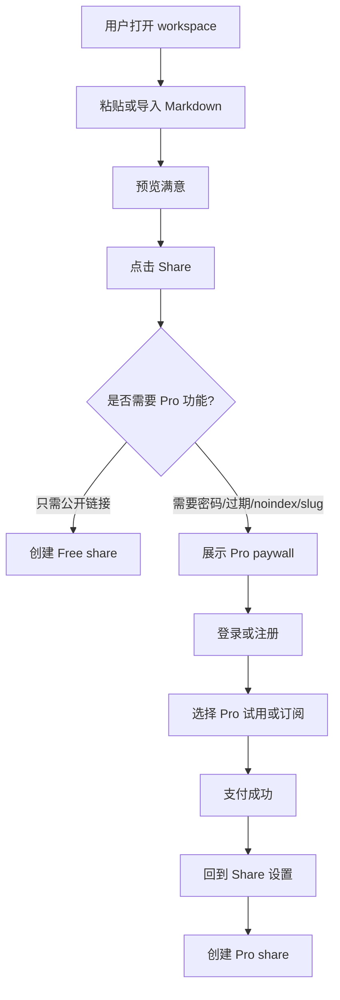
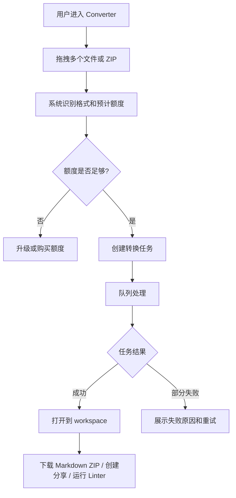
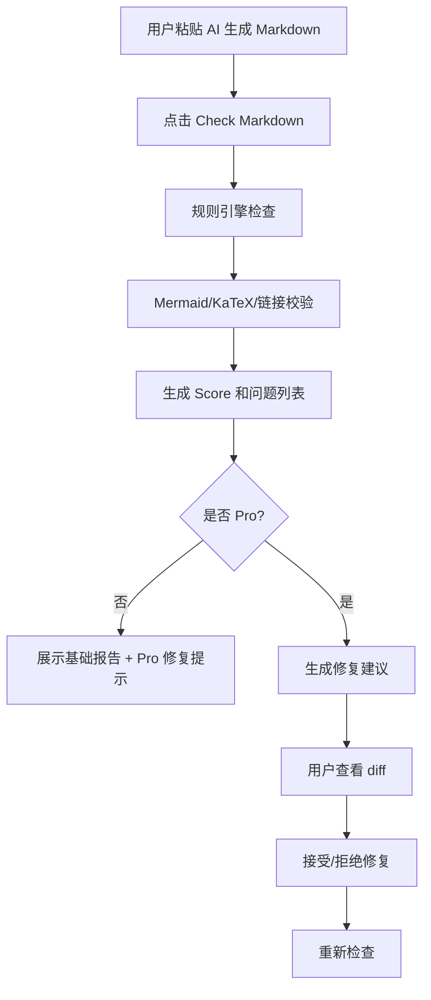
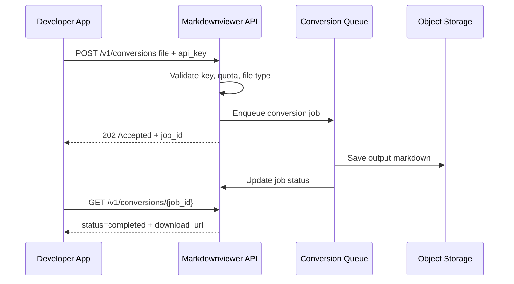
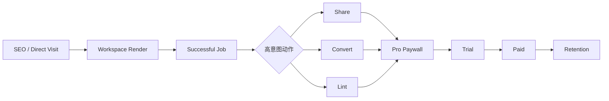

# PRD｜Markdownviewer.run 商业化优化 V1

> 文档状态：正式评审稿
> 版本：v1.0
> 日期：2026-06-09
> 适用产品：`markdownviewer.run`
> 明确排除：`markdownviewer.pages.dev` 不属于本次分析、产品范围、流量假设或技术假设
> 产品负责人：待定
> 设计负责人：待定
> 工程负责人：待定
> 数据负责人：待定

---

## 目录

1. [文档摘要](#1-文档摘要)
2. [背景与机会](#2-背景与机会)
3. [产品现状判断](#3-产品现状判断)
4. [目标用户与核心场景](#4-目标用户与核心场景)
5. [竞品与市场洞察](#5-竞品与市场洞察)
6. [商业化优化方案总览](#6-商业化优化方案总览)
7. [产品目标与成功指标](#7-产品目标与成功指标)
8. [范围定义](#8-范围定义)
9. [功能需求](#9-功能需求)
10. [关键用户流程](#10-关键用户流程)
11. [信息架构与页面规格](#11-信息架构与页面规格)
12. [数据模型与接口建议](#12-数据模型与接口建议)
13. [权限、隐私、安全与滥用治理](#13-权限隐私安全与滥用治理)
14. [增长与商业化设计](#14-增长与商业化设计)
15. [埋点与数据分析方案](#15-埋点与数据分析方案)
16. [非功能性需求](#16-非功能性需求)
17. [里程碑与排期建议](#17-里程碑与排期建议)
18. [验收标准](#18-验收标准)
19. [风险与应对](#19-风险与应对)
20. [开放问题](#20-开放问题)
21. [参考资料](#21-参考资料)

---

## 1. 文档摘要

### 1.1 一句话结论

`markdownviewer.run` 不应把商业化建立在“基础 Markdown 预览”本身，而应把免费预览、文档导入、技术 Markdown 阅读体验作为获客入口，将付费点放在更强痛点的三类任务上：

1. **Share Pro**：把 Markdown 变成可控、可统计、可品牌化的轻量分享/发布页面。
2. **Converter Pro / API**：把 Office、HTML、数据文件、文本型 PDF 等转换为干净 Markdown，并支持批量、历史、API 与更高配额。
3. **AI Markdown QA / Linter**：面向 AI 输出、README、技术文档发布前检查，提供结构评分、渲染校验、链接检查与一键修复。
4. **GitHub README Preview Suite**：作为中后期增强，面向 GitHub 工作流提供 README / CHANGELOG / Release Notes 发布前预览与 PR 自动检查。

### 1.2 推荐商业化路径

优先采用 **“免费工具入口 + Pro 个人订阅 + Team 小团队套餐 + API 按量计费”** 的轻量 SaaS 模式。

首个可上线商业化版本建议聚焦 **Share Pro**，因为当前产品已经具备 stored share links、reader controls、local workspace、export 等基础能力，需求改造路径最短，且相比纯 Viewer 有更明确的付费理由。

第二阶段上线 **Converter Pro**，承接 SEO 长尾需求，如 `document to markdown`、`DOCX to Markdown`、`PDF to Markdown`、`AI markdown reader` 等。

第三阶段上线 **Markdown QA / Linter**，抓住 AI 生成 Markdown 增长带来的“发布前不放心”痛点。

### 1.3 PRD 覆盖范围

本 PRD 覆盖以下内容：

- 现有产品能力归纳与机会判断；
- 竞品与市场洞察；
- 商业化功能包设计；
- 账户、订阅、用量、分享、转换、Linter、GitHub 工作流等需求；
- 数据模型、接口、埋点、验收标准；
- 90 天 MVP 与 6 个月路线图。

本 PRD 不覆盖：

- `markdownviewer.pages.dev` 的任何分析或归因；
- 完整企业销售体系；
- 完整多人实时协作编辑；
- 替代 GitBook / ReadMe 的完整文档站平台；
- 面向所有文件格式的高保真 OCR / 排版还原。

---

## 2. 背景与机会

### 2.1 当前背景

Markdown 仍是开发者、技术写作者、AI 用户、PM、开源维护者广泛使用的结构化文本格式。随着 ChatGPT、Claude、Cursor、Copilot、代码 Agent 等工具普及，越来越多内容默认以 Markdown 输出，包括需求文档、技术方案、README、API 说明、测试计划、变更日志、会议纪要与研究摘要。

基础 Markdown 预览工具供给充足，且大量竞品免费。因此，`markdownviewer.run` 的商业化不能简单依赖“编辑 + 预览”收费，而要围绕用户完成文档任务后的后续动作收费：分享、发布、转换、检查、团队治理、API 自动化。

### 2.2 核心机会

`markdownviewer.run` 已经具备多个适合商业化的资产：

- **技术文档渲染能力**：支持 GFM、代码块、表格、Mermaid、KaTeX 等。
- **多来源导入能力**：支持粘贴、文件、文件夹、GitHub/Gist/raw URL。
- **文档转换能力**：支持常见 Office、HTML、JSON、XML、CSV、文本型 PDF 转 Markdown。
- **分享发布雏形**：已有 stored `/share/{id}` 链接和完整 reader 页面。
- **本地优先叙事**：本地文件与粘贴内容默认留在浏览器，只有转换、远程 URL、公开分享等动作涉及服务端。
- **SEO 可扩展性**：已有围绕 README Viewer、GFM Viewer、Mermaid Viewer、AI Markdown Viewer、Document to Markdown Converter 等任务型页面的基础。

### 2.3 产品战略判断

本产品的免费层应继续保持“打开即用、低摩擦、无需注册”的工具体验；付费层应围绕以下原则设计：

| 原则 | 说明 |
|---|---|
| 免费入口不破坏 | 基础粘贴、预览、文件打开、少量分享与少量转换应保持免费，以维持 SEO 和口碑。 |
| 付费点绑定高意图动作 | 只有当用户要分享、保护、统计、批量转换、API 自动化、发布前检查时才触发付费。 |
| 个人先行，团队后置 | 先服务独立开发者、PM、技术写作者、AI power user，再扩展到团队空间、权限、SSO。 |
| 轻于文档平台 | 不正面替代 GitBook / ReadMe，而是成为“临时、轻量、快速”的 Markdown workspace 和发布前工具。 |
| 安全和隐私明确 | 默认本地、显式上传、显式分享、显式存储，降低用户对工具类产品的信任阻力。 |

---

## 3. 产品现状判断

### 3.1 当前产品定位

`markdownviewer.run` 当前更接近一个 **本地优先的技术 Markdown 阅读、编辑、转换与分享 workspace**，而不是一个普通在线 Markdown viewer。

可公开验证的现有能力包括：

- 在线 Markdown live preview；
- 粘贴 Markdown；
- 打开本地 Markdown 文件；
- 打开本地 docs 文件夹；
- 导入 GitHub、Gist、raw URL；
- 支持 GFM、代码块、表格、Mermaid、KaTeX；
- 转换 DOCX、PPTX、XLSX、CSV、HTML、JSON、XML、文本型 PDF 到 Markdown；
- PWA 安装与文件打开；
- persistent workspace tabs；
- stored `/share/{id}` 分享链接；
- HTML / PDF 导出；
- 中文本地化。

### 3.2 当前短板

| 分类 | 当前短板 | 商业化影响 |
|---|---|---|
| 账户体系 | 缺少用户身份、历史记录、个人 dashboard | 无法做订阅、权限、配额、留存 |
| 付费体系 | 缺少 plan、用量限制、支付、账单 | 无法直接商业化 |
| 分享治理 | 公开分享缺少密码、过期、noindex、删除、统计、举报 | 付费价值不足，滥用风险较高 |
| 转换治理 | 缺少批量转换、转换历史、队列、额度、失败原因、质量报告 | 难以按量收费 |
| AI QA | 缺少 Markdown 质量检测、修复、发布前检查 | 无法捕获 AI 输出增长红利 |
| 数据分析 | 缺少完整 funnel、事件、转化归因 | 无法判断哪个场景能付费 |
| B2B 能力 | 缺少团队、权限、审计、SSO、合同 | 短期不适合企业销售 |

### 3.3 产品北极星定位

建议将产品定位从：

> Free online Markdown viewer

升级为：

> The fastest local-first Markdown workspace for reading, converting, checking, and sharing technical documents.

中文表达：

> 面向技术文档和 AI 输出的本地优先 Markdown 工作台：阅读、转换、检查、分享，一站完成。

---

## 4. 目标用户与核心场景

### 4.1 用户画像

#### Persona A：独立开发者 / 开源维护者

- 典型任务：检查 README、CHANGELOG、Release Notes、API docs、Mermaid 图、安装说明。
- 痛点：GitHub 提交后才发现渲染问题；本地预览配置麻烦；分享草稿不够方便。
- 付费意愿：中低，愿意为 GitHub workflow、自动检查、公开项目免费/低价付费。
- 关键功能：GitHub 导入、GFM 预览、Mermaid/KaTeX、链接检查、PR bot、custom slug。

#### Persona B：AI power user / PM / 咨询顾问

- 典型任务：把 ChatGPT/Claude/Cursor 生成的 Markdown 报告转成可读页面、分享给同事或客户。
- 痛点：AI 输出很长、格式乱、表格/代码/标题不稳定；复制到文档工具会丢格式。
- 付费意愿：中，愿意为漂亮分享、密码访问、过期链接、AI cleanup 付费。
- 关键功能：粘贴即预览、分享链接、密码、过期、品牌样式、Markdown QA、一键修复。

#### Persona C：技术写作者 / 文档负责人

- 典型任务：把 Word、PPT、HTML、CSV、JSON、PDF 转成 Markdown，再发布到 docs 或 knowledge base。
- 痛点：转换质量不稳定，手动清理耗时；需要批量迁移旧资料。
- 付费意愿：中高，愿意为批量转换、转换历史、API、ZIP 导出、格式保真付费。
- 关键功能：Converter Pro、批量任务、API、转换报告、表格保留、图片处理。

#### Persona D：小团队 / Startup 文档协作负责人

- 典型任务：临时发布内部规范、客户交付文档、FAQ、方案说明、操作手册。
- 痛点：GitBook/ReadMe 太重；Notion 对 Markdown 技术渲染不够直接；静态站搭建成本高。
- 付费意愿：中高，愿意为团队空间、私密链接、访问统计、品牌控制付费。
- 关键功能：Team workspace、成员、私密分享、评论、访问统计、主题、团队模板。

### 4.2 Jobs To Be Done

| 编号 | 用户任务 | 当前替代方案 | 机会 |
|---|---|---|---|
| JTBD-01 | 我想快速检查 Markdown 是否渲染正确 | GitHub 预览、VS Code 插件、Dillinger、StackEdit | 免费获客入口 |
| JTBD-02 | 我想把 Markdown 分享给别人，并保持漂亮阅读体验 | Gist、GitHub、Notion、HackMD、粘贴到邮件 | Share Pro |
| JTBD-03 | 我想把 Office / HTML / PDF 转 Markdown | Pandoc、在线转换工具、手工复制 | Converter Pro / API |
| JTBD-04 | 我想确认 AI 生成的 Markdown 能发布 | 人工检查、粘贴到 GitHub、编辑器插件 | AI Markdown QA |
| JTBD-05 | 我想在 PR 前检查 README 和链接 | GitHub 渲染、CI 自建脚本 | GitHub Preview Suite |

---

## 5. 竞品与市场洞察

### 5.1 竞品分层

| 层级 | 代表产品 | 用户认知 | 主要强项 | 对 markdownviewer.run 的启示 |
|---|---|---|---|---|
| 免费在线编辑器 | Dillinger、StackEdit | 免费、浏览器打开即用 | Live preview、云同步、离线、导出 | 基础预览难以收费，必须保持免费入口 |
| 协作文档 Markdown | HackMD | 多人协作、团队 Markdown | 实时协作、权限、评论、GitHub、API | 付费价值来自协作、权限、API、版本 |
| 文档站平台 | GitBook、ReadMe | 正式产品文档/API 文档 | Custom domain、AI search、analytics、SSO、审计 | 高客单价来自发布、治理、AI 与团队管理 |
| 本地知识库 | Obsidian | 本地优先、知识库、插件 | Local-first、Sync、Publish、隐私叙事 | 本地优先可增强信任，发布/同步可收费 |
| 开发者工作流 | GitHub、VS Code 插件 | 默认工作环境 | GFM、PR、CI、编辑器生态 | 不替代 GitHub，而是补充预览、质检和分享 |

### 5.2 核心竞品对比

| 产品 | 定位 | 免费能力 | 付费能力 | 商业化启示 |
|---|---|---|---|---|
| Dillinger | 免费在线 Markdown 编辑器 | Live preview、云同步、导出、无需注册 | 无明显付费层 | 证明基础 editor/viewer 竞争激烈、价格接近 0 |
| StackEdit | 浏览器 Markdown 编辑器 | 编辑、Scroll Sync、同步、发布、协作、评论、离线 | 公开资料中未体现强商业层 | 提醒我们不要只做编辑体验，而要做任务完成闭环 |
| HackMD | Markdown 协作平台 | 无限 notes、少量邀请、GitHub 集成 | Prime $5/seat/mo，搜索、PDF、版本、API、更多邀请；Enterprise 有 RBAC/SSO/custom domain | 个人/团队订阅可行，权限与 API 是付费锚点 |
| GitBook | 产品文档平台 | 免费 site、Git sync、API playground、LLM 优化 | Premium/Ultimate/Enterprise，AI search、custom domain、analytics、authenticated access、SSO | 文档发布与 AI 搜索能支撑高客单价，但产品更重 |
| ReadMe | API/产品文档平台 | Starter 免费、custom domain、API reference、Markdown editor、AI 基础能力 | Pro $250/mo、Enterprise $3000+/mo，private docs、AI Linter、branch review、SSO、audit logs | AI Linter、私密文档、审计说明发布前检查有商业价值 |
| Obsidian | 本地 Markdown 知识库 | 本地免费、无注册 | Sync、Publish、Commercial license | 本地优先 + 可选发布/同步是可被用户接受的收费结构 |

### 5.3 市场趋势判断

#### 趋势 1：Markdown 是开发者文档与协作的重要基础格式

Stack Overflow 2025 Developer Survey 显示，Markdown File 在代码文档与协作工具中持续受到开发者认可。这意味着 Markdown 不是小众格式，而是开发者工作流中的基础层。

#### 趋势 2：AI 让 Markdown 产出量激增

大量 AI 工具默认以 Markdown 输出结构化内容。开发者、PM、咨询顾问、学生和运营人员都会把 AI 生成内容用于报告、需求、技术方案、README、脚本说明等。这会增加“阅读、清理、分享、检查 Markdown”的需求。

#### 趋势 3：AI 输出的“差一点正确”带来质检机会

AI 生成内容的核心问题不是完全不可用，而是经常格式、链接、代码、结构、引用、表格、图表有瑕疵。因此，Markdown QA / Linter 可以作为 AI workflow 的发布前质量门禁。

#### 趋 4：隐私、价格、替代品是开发者工具采用的关键阻碍

工具类产品必须控制价格，并强调隐私、透明和本地优先。若付费墙过早影响基础预览，会损害获客和信任。

### 5.4 机会结论

`markdownviewer.run` 的商业化窗口不在“大而全团队文档站”，而在 **轻量、高频、任务导向** 的 Markdown 工作流：

- 看：把 Markdown 变得可读；
- 转：把文档变成 Markdown；
- 查：把 Markdown 发布前检查清楚；
- 发：把 Markdown 安全、漂亮地分享出去。

---

## 6. 商业化优化方案总览

### 6.1 方案一：Share Pro

#### 核心价值

把 Markdown 快速发布成可阅读、可控制、可统计、可品牌化的在线页面。

#### 目标用户

- AI power user；
- PM / 咨询顾问；
- 技术写作者；
- 独立开发者；
- 小团队。

#### 付费功能

| 功能 | Free | Pro | Team |
|---|---:|---:|---:|
| 公开分享链接 | 每月 5 个 | 每月 100 个 | 每月 1,000 个 |
| 私密链接 | - | 支持 | 支持 |
| 密码访问 | - | 支持 | 支持 |
| 链接过期 | - | 支持 | 支持 |
| 自定义 slug | - | 支持 | 支持 |
| noindex | - | 支持 | 支持 |
| 删除 / 下线分享 | 支持 | 支持 | 支持 |
| 访问统计 | - | 基础 | 高级 |
| 品牌移除 | - | 支持 | 支持 |
| 自定义主题 | - | 支持 | 支持 |
| 团队共享库 | - | - | 支持 |

#### 变现模式

- Pro：$8/月或 $80/年；
- Team：$39/月起，含 5 seats；
- Enterprise：暂不主动销售，仅保留 contact入口。

#### 优先级

P0 / 第一阶段上线。

---

### 6.2 方案二：Converter Pro / API

#### 核心价值

将 Office、HTML、JSON、XML、CSV、文本型 PDF 等文件批量转换为 Markdown，并提供可追踪、可下载、可自动化的转换结果。

#### 目标用户

- 技术写作者；
- 知识库迁移用户；
- AI/RAG 工程师；
- 内容运营；
- 咨询顾问；
- 教育和研究用户。

#### 付费功能

| 功能 | Free | Pro | API |
|---|---:|---:|---:|
| 单文件转换 | 每月 10 次 | 每月 500 次 | 按量 |
| 文件大小上限 | 10 MB | 100 MB | 200 MB 起 |
| 批量转换 | - | 支持 | 支持 |
| ZIP 上传 | - | 支持 | 支持 |
| 转换历史 | - | 30 天 | 可配置 |
| Markdown ZIP 导出 | - | 支持 | 支持 |
| API Key | - | - | 支持 |
| Webhook | - | - | 支持 |
| OCR PDF | - | 另计额度 | 另计额度 |
| 转换质量报告 | - | 支持 | 支持 |

#### 变现模式

- Pro：$12/月或 $120/年；
- API Starter：$19/月含基础额度；
- API Usage：按页数、文件数或处理时长计费；
- OCR：作为独立加价项，避免成本不可控。

#### 优先级

P1 / 第二阶段上线。

---

### 6.3 方案三：AI Markdown QA / Linter

#### 核心价值

在 Markdown 发布或分享前，自动发现格式、结构、链接、代码块、Mermaid、KaTeX、目录、标题层级等问题，并提供一键修复建议。

#### 目标用户

- 使用 AI 生成文档的人；
- README / CHANGELOG 维护者；
- 技术写作者；
- PM / 产品运营；
- 小团队文档 owner。

#### 付费功能

| 功能 | Free | Pro | Team |
|---|---:|---:|---:|
| 基础 Markdown 检查 | 每日 5 次 | 无限或高额度 | 高额度 |
| README Score | 支持 | 支持 | 支持 |
| 链接检查 | 限量 | 支持 | 支持 |
| Mermaid / KaTeX 渲染检查 | 支持 | 支持 | 支持 |
| AI Cleanup | - | 支持 | 支持 |
| 一键修复 | - | 支持 | 支持 |
| 自定义规则 | - | - | 支持 |
| 团队规则模板 | - | - | 支持 |
| GitHub Action | - | 支持 | 支持 |
| PR 评论 | - | - | 支持 |

#### 变现模式

- Pro：$10/月；
- Team：$49/月起；
- GitHub Action：按 repo 或检查次数计费。

#### 优先级

P2 / 第三阶段上线。建议先做静态规则引擎，再引入 LLM 修复，避免成本和质量不可控。

---

### 6.4 方案四：GitHub README Preview Suite

#### 核心价值

在 README、CHANGELOG、Release Notes 合并前，模拟 GitHub/GFM 渲染，检查链接、图片、锚点、目录、Mermaid、代码块、badge 与发布质量。

#### 目标用户

- 开源维护者；
- 独立开发者；
- SDK / npm / PyPI 包作者；
- 小团队工程负责人。

#### 功能范围

- GitHub URL 导入增强；
- README diff preview；
- PR preview bot；
- broken link check；
- markdown lint report；
- release notes preview；
- GitHub Action；
- repo-level rules。

#### 优先级

P3 / 第四阶段上线。建议在 Share Pro、Converter Pro、Linter 已验证后再做。

---

## 7. 产品目标与成功指标

### 7.1 业务目标

| 时间范围 | 目标 | 衡量指标 |
|---|---|---|
| 30 天 | 建立商业化基础设施 | 账户、订阅、用量、埋点、dashboard 可用 |
| 60 天 | 验证 Share Pro 付费意愿 | Pro 试用转化率、付费用户数、分享链路转化 |
| 90 天 | 验证 Converter Pro 需求 | 批量转换使用率、转换成功率、付费升级率 |
| 180 天 | 验证 Linter / API 扩展 | Linter 留存、API 使用量、Team 线索数 |

### 7.2 北极星指标

**Weekly Successful Markdown Jobs（WSMJ）**：每周成功完成的 Markdown 任务数。

一次成功 Markdown 任务定义为任一动作：

- 成功创建 share link；
- 成功完成 document-to-Markdown conversion；
- 成功完成 Markdown QA / Linter 检查；
- 成功导出 HTML / PDF；
- 成功保存本地 folder workspace 修改。

### 7.3 关键指标

#### Acquisition

- SEO landing page visits；
- workspace start rate；
- sample open rate；
- paste/import/file open rate；
- first successful render rate。

#### Activation

- 首次创建分享链接比例；
- 首次转换成功比例；
- 首次 Linter 检查完成比例；
- 首次导出比例；
- 注册转化率。

#### Revenue

- Free → Pro 转化率；
- Pro trial → paid 转化率；
- MRR；
- ARPPU；
- churn；
- API usage revenue；
- Team plan 线索数。

#### Retention

- D1 / D7 / D30 retention；
- 每周成功 Markdown 任务数；
- 每用户分享链接数；
- 每用户转换文件数；
- 每用户 Linter 检查数。

#### Quality

- 转换成功率；
- 转换失败率与失败原因分布；
- 分享页面打开成功率；
- Linter false positive 反馈率；
- 页面渲染错误率；
- P95 workspace load time。

---

## 8. 范围定义

### 8.1 MVP 范围

MVP 由三层组成：

1. **商业化基础层**：账户、订阅、用量、支付、dashboard、埋点。
2. **Share Pro**：私密分享、密码、过期、slug、noindex、统计、品牌设置。
3. **Converter Pro Beta**：批量转换、用量限制、历史记录、ZIP 导出。

### 8.2 非 MVP 范围

以下需求不进入首个商业化 MVP：

- 完整实时多人协同编辑；
- SAML SSO；
- 企业审计日志；
- 自定义域名正式版；
- OCR 高保真 PDF 处理；
- 完整 GitHub App PR 评论；
- 多语言自动翻译；
- 移动端原生 App；
- 完整 docs site CMS。

### 8.3 P0 / P1 / P2 定义

| 优先级 | 定义 |
|---|---|
| P0 | 商业化上线必须具备；缺失会阻断收费或核心体验。 |
| P1 | 上线后 1-2 个迭代内必须补齐；显著影响转化或留存。 |
| P2 | 中期增强；用于提升 ARPU、团队化或差异化。 |
| P3 | 长期探索；依赖前序验证。 |

---

## 9. 功能需求

## 9.1 商业化基础层

### FR-BASE-001：用户账户

**优先级**：P0
**用户故事**：作为用户，我可以创建账户并登录，以便管理我的分享链接、转换历史、付费计划和 API key。

**功能要求**：

- 支持邮箱登录；
- 支持 OAuth 登录，优先 GitHub，其次 Google；
- 支持匿名使用 workspace；
- 当匿名用户触发付费功能时，引导注册；
- 注册后可选择把当前本地 session 中的 share/conversion/lint 任务绑定到账户。

**验收标准**：

- 用户可完成注册、登录、登出；
- 登录态刷新后保持；
- 匿名 workspace 不被强制中断；
- 从匿名到登录后，当前文档内容不丢失；
- 所有需账户的功能会显示清晰 CTA。

---

### FR-BASE-002：订阅与支付

**优先级**：P0
**用户故事**：作为用户，我可以选择 Free / Pro / Team / API 套餐并完成支付。

**功能要求**：

- 支持 Free、Pro、Team、API Starter 四个 plan；
- 支持月付、年付；
- 支持试用期，建议 7 天或 14 天；
- 支持取消订阅；
- 支持账单页查看当前 plan、续费日期、发票入口；
- 支持升级、降级、超额提醒。

**验收标准**：

- 用户可从 pricing page 成功进入 checkout；
- 支付成功后 plan 权限即时生效；
- 支付失败时显示可理解错误；
- 取消订阅后到期前仍保留权益；
- Webhook 失败可重试，不造成权益错乱。

---

### FR-BASE-003：用量与配额系统

**优先级**：P0
**用户故事**：作为产品运营者，我可以按 plan 限制分享、转换、Linter、API 的用量，并向用户展示剩余额度。

**功能要求**：

- 建立 Usage Ledger；
- 记录 share_created、conversion_page_processed、lint_run、api_call 等用量；
- 支持月度重置；
- 支持软限制和硬限制；
- 支持超额提示、升级提示；
- Dashboard 展示本月用量。

**验收标准**：

- 每次用量消耗都能被记录；
- 超出额度时，用户无法继续使用付费能力或进入升级流程；
- Dashboard 展示与后台记录一致；
- 退款、降级、取消不会造成负额度异常。

---

### FR-BASE-004：用户 Dashboard

**优先级**：P0
**用户故事**：作为登录用户，我可以在 dashboard 管理我的分享链接、转换历史、Linter 报告、API key 和账单。

**页面模块**：

- Overview；
- My Shares；
- Conversions；
- Lint Reports；
- Usage；
- API Keys；
- Billing；
- Settings。

**验收标准**：

- 登录用户可进入 dashboard；
- 每个模块有空状态；
- 分享、转换、Linter 记录可搜索、筛选、删除；
- 移动端可基本使用。

---

## 9.2 Share Pro

### FR-SHARE-001：分享链接创建升级

**优先级**：P0
**用户故事**：作为用户，我可以将当前 Markdown 创建为一个稳定分享链接，并在创建时选择公开、私密、密码、过期等设置。

**功能要求**：

创建分享链接时提供以下配置：

- 标题；
- 描述；
- visibility：public / unlisted / private；
- password：可选；
- expiration：never / 1 day / 7 days / 30 days / custom；
- indexing：allow index / noindex；
- slug：自动生成或自定义；
- theme：默认 / GitHub / Reader / Minimal；
- branding：显示或隐藏 Markdownviewer 品牌；
- allow duplicate：是否允许重复创建相同内容。

**验收标准**：

- Free 用户可创建公开链接，但有月度额度；
- Pro 用户可创建私密、密码、过期、noindex、自定义 slug 链接；
- 创建成功后返回可复制链接；
- 失败时显示原因，如 slug 已占用、额度不足、内容过大；
- 分享页面在无登录状态下可按权限正常访问。

---

### FR-SHARE-002：分享页面访问控制

**优先级**：P0
**用户故事**：作为分享链接创建者，我可以控制别人是否能访问我的文档。

**访问规则**：

| visibility | 访问方式 | 搜索引擎 | 适用 plan |
|---|---|---|---|
| public | 任何人可访问 | 可索引 | Free / Pro / Team |
| unlisted | 有链接者可访问 | 默认 noindex | Pro / Team |
| private | 创建者或指定团队成员访问 | noindex | Team |
| password | 输入密码访问 | noindex | Pro / Team |
| expired | 显示过期页 | noindex | Pro / Team |

**验收标准**：

- 密码错误时不泄露文档标题与内容；
- 过期链接显示清楚的过期说明；
- noindex 页面正确输出 meta robots；
- 删除后的链接返回 404 或 deleted state；
- 权限检查不能仅依赖前端。

---

### FR-SHARE-003：分享链接管理

**优先级**：P0
**用户故事**：作为用户，我可以查看、编辑、删除、下线我的分享链接。

**功能要求**：

- 列表展示：标题、创建时间、可见性、访问量、过期时间、最后访问时间；
- 支持按状态筛选：active、expired、deleted；
- 支持修改标题、描述、密码、过期时间、可见性、theme；
- 支持复制链接；
- 支持重新生成 slug；
- 支持删除或临时下线；
- 支持导出 HTML / PDF。

**验收标准**：

- 用户只能管理自己的链接；
- 修改设置后立即生效；
- 删除操作二次确认；
- 删除后后台记录保留最少审计字段，但不再展示内容。

---

### FR-SHARE-004：分享访问统计

**优先级**：P1
**用户故事**：作为 Pro 用户，我可以查看分享页面的访问数据，以判断文档是否被阅读。

**功能要求**：

- 页面总访问量；
- 独立访客估算；
- 最近 7/30 天趋势；
- referrer domain；
- 国家/地区粗粒度统计；
- 设备类型；
- 平均阅读时长；
- 导出点击数；
- 复制代码/链接点击数。

**隐私要求**：

- 默认不采集完整 IP；
- IP 仅用于粗粒度地理计算后丢弃或哈希；
- 提供隐私说明；
- 对 EU/UK 用户注意 cookie consent 或避免非必要 cookie。

**验收标准**：

- 统计延迟不超过 5 分钟；
- 分享页面访问不会明显变慢；
- 创建者可在 dashboard 查看单链接统计。

---

### FR-SHARE-005：品牌与主题

**优先级**：P1
**用户故事**：作为 Pro / Team 用户，我可以让分享页面更符合我的个人或团队品牌。

**功能要求**：

- 选择主题；
- 设置字体大小默认值；
- 设置页面宽度；
- 设置代码主题；
- 上传 logo；
- 隐藏 Markdownviewer branding；
- 设置 footer 文案；
- Team 可设置默认模板。

**验收标准**：

- 主题设置在分享页面生效；
- 不允许上传可执行脚本；
- logo 文件大小和类型受限制；
- Free 用户看到升级提示。

---

## 9.3 Converter Pro / API

### FR-CONV-001：单文件转换增强

**优先级**：P0
**用户故事**：作为用户，我可以上传文件并转换为 Markdown，转换完成后直接在 workspace 中编辑和预览。

**支持格式**：

- DOCX；
- PPTX；
- XLSX / XLS；
- CSV；
- HTML；
- JSON；
- XML；
- text-heavy PDF；
- TXT / MD / MDX。

**功能要求**：

- 转换前显示文件名、大小、格式、预计消耗额度；
- 转换后打开为新 workspace tab；
- 展示转换质量提示，如“检测到复杂表格，可能需要人工校对”；
- 转换失败展示具体可理解原因；
- 支持下载 Markdown。

**验收标准**：

- 支持格式可成功进入转换流程；
- 不支持格式明确提示；
- 转换失败不扣除用户额度或按策略退回；
- 大文件超限时显示升级提示。

---

### FR-CONV-002：批量转换

**优先级**：P1
**用户故事**：作为 Pro 用户，我可以一次上传多个文件或 ZIP，将它们批量转换为 Markdown。

**功能要求**：

- 支持拖拽多个文件；
- 支持 ZIP 上传；
- 任务队列展示每个文件状态；
- 支持 cancel / retry；
- 支持批量下载为 ZIP；
- 保留原始文件夹结构；
- 支持失败文件单独重试。

**验收标准**：

- 同一批次至少支持 20 个文件；
- 单个失败不影响其他文件完成；
- 下载 ZIP 中包含 `.md` 文件和 `conversion-report.json`；
- 队列刷新后状态不丢失。

---

### FR-CONV-003：转换历史

**优先级**：P1
**用户故事**：作为 Pro 用户，我可以回看最近的转换任务、重新下载结果或重新打开到 workspace。

**功能要求**：

- 列表展示：文件名、格式、大小、状态、创建时间、消耗额度；
- 支持打开结果；
- 支持下载结果；
- 支持删除结果；
- 默认保留 30 天；
- 用户可手动永久删除。

**验收标准**：

- 历史记录只对本人可见；
- 删除后结果文件不可访问；
- 到期自动清理；
- 清理策略在 UI 中说明。

---

### FR-CONV-004：转换质量报告

**优先级**：P1
**用户故事**：作为用户，我希望知道转换结果是否可靠，哪里可能需要人工检查。

**报告内容**：

- 输入文件基本信息；
- 转换耗时；
- 输出 Markdown 字数；
- 图片数量；
- 表格数量；
- 代码块数量；
- 警告项：复杂表格、空白页、低文本密度、未识别图片文字、嵌入对象丢失等；
- 建议下一步：打开 Linter、下载、分享。

**验收标准**：

- 每个转换任务生成报告；
- 报告可在 dashboard 查看；
- 报告可被 API 返回。

---

### FR-CONV-005：API Key 与转换 API

**优先级**：P2
**用户故事**：作为开发者，我可以通过 API 将文件转换为 Markdown，用于自动化工作流。

**功能要求**：

- API key 创建、重命名、撤销；
- API key 权限 scope：convert、read_jobs、delete_jobs；
- 上传文件并创建转换任务；
- 查询任务状态；
- 下载 Markdown；
- Webhook 通知；
- Rate limit；
- API 文档与示例。

**验收标准**：

- 无效 key 拒绝访问；
- 超额时返回明确错误码；
- 任务状态可轮询；
- Webhook 签名可验证；
- API 错误有稳定 code。

---

## 9.4 AI Markdown QA / Linter

### FR-LINT-001：基础 Markdown 检查

**优先级**：P1
**用户故事**：作为用户，我可以检查当前 Markdown 是否存在结构、格式或渲染问题。

**检查项**：

- 标题层级跳跃；
- 缺少 H1；
- 多个 H1；
- 空标题；
- 重复标题导致锚点冲突；
- 表格列数不一致；
- 代码块未闭合；
- 代码块缺少语言标记；
- 链接格式错误；
- 图片缺少 alt；
- Mermaid 渲染失败；
- KaTeX 渲染失败；
- HTML raw block 安全风险；
- 超长段落；
- TOC 锚点异常。

**验收标准**：

- 用户点击 Check 后生成报告；
- 报告按 error / warning / suggestion 分类；
- 每个问题定位到行号或区块；
- 点击问题可跳转到编辑器位置；
- 检查不修改原文。

---

### FR-LINT-002：Markdown Quality Score

**优先级**：P1
**用户故事**：作为用户，我可以得到一个可理解的 Markdown 发布质量分数。

**评分维度**：

- Structure：标题、层级、目录；
- Renderability：表格、代码、Mermaid、KaTeX；
- Readability：段落长度、列表结构、代码说明；
- Link Health：链接与锚点；
- Share Readiness：标题、描述、首屏可读性；
- README Readiness：安装、用法、许可证、贡献说明等可选检查。

**验收标准**：

- 评分范围 0-100；
- 分数背后有可解释项；
- 修复问题后重新检查分数变化；
- 不把分数设计成绝对质量判断，UI 中说明“用于发布前参考”。

---

### FR-LINT-003：一键修复建议

**优先级**：P2
**用户故事**：作为 Pro 用户，我可以让系统生成修复建议，并选择性应用。

**功能要求**：

- 对确定性问题使用规则修复，如标题层级、表格列、代码块闭合；
- 对内容类问题使用 AI 建议，如摘要、标题重写、段落拆分；
- 展示 diff；
- 用户确认后应用；
- 支持 undo；
- 对敏感文档提示上传/AI 处理风险。

**验收标准**：

- 修复前必须展示 diff；
- 用户可逐条接受或拒绝；
- 修复不会自动创建分享链接；
- AI 修复失败时不影响原文。

---

### FR-LINT-004：团队规则模板

**优先级**：P3
**用户故事**：作为团队管理员，我可以定义团队文档规范并用于所有成员的 Markdown 检查。

**功能要求**：

- 规则开关；
- README 模板；
- 标题层级约束；
- 代码块语言要求；
- 链接白名单/黑名单；
- 禁用 raw HTML；
- 必须包含章节；
- 导出规则配置。

**验收标准**：

- Team admin 可配置；
- 成员检查时默认应用团队规则；
- 报告中区分系统规则和团队规则。

---

## 9.5 GitHub README Preview Suite

### FR-GH-001：GitHub URL 导入增强

**优先级**：P2
**用户故事**：作为开发者，我可以输入 GitHub repo 或 README URL，系统自动拉取并预览文档。

**功能要求**：

- 支持 repo URL；
- 支持 README URL；
- 支持 branch/path 参数；
- 自动解析相对图片和链接；
- 支持 private repo 作为未来能力，仅 OAuth 后可访问。

**验收标准**：

- 公共 repo README 可正常拉取；
- 相对图片尽量解析为 raw URL；
- 拉取失败显示原因；
- 不缓存 private 内容，除非用户显式创建分享或保存。

---

### FR-GH-002：PR / GitHub Action 检查

**优先级**：P3
**用户故事**：作为团队工程师，我可以在 PR 中自动检查 Markdown 问题。

**功能要求**：

- GitHub Action 配置示例；
- CLI 或 API 调用；
- 输出 Markdown report；
- 可设置失败阈值；
- Team 版本支持 PR comment。

**验收标准**：

- Action 可在公开 repo 跑通；
- 阈值触发时 CI fail；
- 报告可链接回 markdownviewer.run 查看详情。

---

## 9.6 管理后台与运营工具

### FR-ADMIN-001：分享内容滥用治理

**优先级**：P0
**功能要求**：

- 分享页面提供 Report abuse；
- 管理后台查看举报；
- 管理员可下线分享链接；
- 管理员可封禁用户；
- 支持内容 hash 去重；
- 支持限制高频创建。

**验收标准**：

- 被举报内容可在后台定位；
- 下线后分享页面不可访问；
- 封禁用户无法继续创建 share；
- 后台操作有审计记录。

---

### FR-ADMIN-002：用量和成本监控

**优先级**：P0
**功能要求**：

- 每日 share 数；
- 存储占用；
- 转换任务数；
- 转换失败率；
- Linter/AI 调用成本；
- API 调用量；
- 免费额度消耗；
- 超额用户列表。

**验收标准**：

- 管理员可以查看按日趋势；
- 成本异常有告警；
- 可导出 CSV。

---

## 10. 关键用户流程

### 10.1 免费用户创建分享链接并升级 Pro



### 10.2 批量文档转 Markdown



### 10.3 AI Markdown QA



### 10.4 API 转换流程



---

## 11. 信息架构与页面规格

### 11.1 顶层导航建议

| 导航项 | 说明 |
|---|---|
| Workspace | 当前核心工作台 |
| Convert | 文档转 Markdown 入口 |
| Share | 分享页介绍与示例 |
| Linter | Markdown QA / README Score |
| Pricing | 价格页 |
| Changelog | 保持现有更新信任 |
| Docs / API | API 和使用文档，第二阶段上线 |
| Sign in | 登录入口 |

### 11.2 Workspace 页面改造

#### 新增区域

- 顶部显示当前登录态；
- Share 按钮旁显示 Free quota；
- Convert 按钮旁显示剩余额度；
- 新增 Check 按钮；
- 对 Pro 功能展示轻量 badge；
- 右侧 reader controls 保持现有体验；
- 不登录仍可粘贴、预览、导出基础内容。

#### 关键 CTA

| 场景 | CTA |
|---|---|
| 用户首次渲染成功 | “Share this Markdown” |
| 用户创建第 1 个免费 share | “Make it private with Pro” |
| 用户使用转换功能 | “Batch convert with Pro” |
| 用户粘贴 AI 输出 | “Check AI Markdown output” |
| 用户超出额度 | “Upgrade to continue” |

### 11.3 Pricing 页面规格

建议价格页使用四列：

| Plan | 目标用户 | 价格 | 核心权益 |
|---|---|---:|---|
| Free | 偶尔查看和预览 | $0 | 基础预览、少量 share、少量 conversion、基础 lint |
| Pro | 个人高频用户 | $8-12/月 | 私密分享、密码、过期、统计、批量转换、AI cleanup |
| Team | 小团队 | $39-59/月 | 团队空间、成员、共享模板、团队统计、规则 |
| API | 开发者自动化 | $19/月起 | API key、批量转换、Webhook、按量计费 |

页面必须明确：

- 基础使用无需注册；
- 本地文件和粘贴内容默认留在浏览器；
- 创建 share 会存储 Markdown；
- 转换文件会上传处理；
- AI 修复可能发送内容到模型服务，需用户确认。

### 11.4 Dashboard 页面规格

#### Overview

- 当前 plan；
- 本月用量；
- 最近 shares；
- 最近 conversions；
- 最近 lint reports；
- 升级 CTA。

#### My Shares

- 列表、搜索、筛选；
- 批量删除；
- 访问统计；
- 权限设置；
- 复制链接。

#### Conversions

- 批次视图；
- 文件视图；
- 状态、错误原因、下载；
- 保留期说明。

#### Lint Reports

- 分数；
- 问题数；
- 打开报告；
- 重新运行。

#### API Keys

- 创建 key；
- 撤销 key；
- 查看 usage；
- API docs link。

---

## 12. 数据模型与接口建议

> 以下为产品需求层建议，具体实现可由工程根据现有架构调整。

### 12.1 核心数据对象

#### User

| 字段 | 类型 | 说明 |
|---|---|---|
| id | string | 用户 ID |
| email | string | 邮箱 |
| name | string | 昵称 |
| avatar_url | string | 头像 |
| auth_provider | enum | email / github / google |
| created_at | datetime | 创建时间 |
| last_login_at | datetime | 最近登录 |
| status | enum | active / suspended / deleted |

#### Subscription

| 字段 | 类型 | 说明 |
|---|---|---|
| id | string | 订阅 ID |
| user_id | string | 用户 ID |
| plan | enum | free / pro / team / api / enterprise |
| billing_cycle | enum | monthly / yearly |
| status | enum | active / trialing / past_due / canceled |
| current_period_start | datetime | 当前周期开始 |
| current_period_end | datetime | 当前周期结束 |
| provider_customer_id | string | 支付服务 customer ID |
| provider_subscription_id | string | 支付服务 subscription ID |

#### ShareDocument

| 字段 | 类型 | 说明 |
|---|---|---|
| id | string | share ID |
| owner_id | string | 创建者 |
| slug | string | URL slug |
| title | string | 标题 |
| description | string | 描述 |
| markdown_blob_url | string | Markdown 存储位置 |
| content_hash | string | 内容 hash |
| visibility | enum | public / unlisted / private |
| password_hash | string | 密码 hash，可为空 |
| expires_at | datetime | 过期时间 |
| noindex | boolean | 是否禁止索引 |
| theme | string | 分享主题 |
| branding_hidden | boolean | 是否隐藏品牌 |
| status | enum | active / expired / deleted / suspended |
| created_at | datetime | 创建时间 |
| updated_at | datetime | 更新时间 |

#### ConversionJob

| 字段 | 类型 | 说明 |
|---|---|---|
| id | string | job ID |
| owner_id | string | 用户 ID |
| batch_id | string | 批次 ID，可为空 |
| source_filename | string | 原文件名 |
| source_type | string | 文件类型 |
| source_size | number | 文件大小 |
| status | enum | queued / running / completed / failed / canceled |
| output_blob_url | string | 输出 Markdown |
| report_blob_url | string | 转换报告 |
| error_code | string | 错误码 |
| error_message | string | 错误说明 |
| quota_units | number | 消耗额度 |
| created_at | datetime | 创建时间 |
| completed_at | datetime | 完成时间 |
| expires_at | datetime | 结果清理时间 |

#### LintRun

| 字段 | 类型 | 说明 |
|---|---|---|
| id | string | 检查 ID |
| owner_id | string | 用户 ID，可为空 |
| source_type | enum | workspace / share / conversion / api |
| source_id | string | 来源 ID |
| score | number | 0-100 |
| error_count | number | 错误数 |
| warning_count | number | 警告数 |
| suggestion_count | number | 建议数 |
| report_json | json | 检查报告 |
| created_at | datetime | 创建时间 |

#### UsageLedger

| 字段 | 类型 | 说明 |
|---|---|---|
| id | string | 记录 ID |
| user_id | string | 用户 ID |
| event_type | enum | share_created / conversion_unit / lint_run / api_call / ai_fix |
| units | number | 消耗数量 |
| period | string | 计费周期 |
| source_id | string | 来源对象 ID |
| created_at | datetime | 创建时间 |

### 12.2 API 建议

#### Share API

```http
POST /api/shares
GET /api/shares
GET /api/shares/{id}
PATCH /api/shares/{id}
DELETE /api/shares/{id}
GET /api/shares/{id}/analytics
```

#### Conversion API

```http
POST /api/conversions
GET /api/conversions
GET /api/conversions/{id}
DELETE /api/conversions/{id}
POST /api/conversion-batches
GET /api/conversion-batches/{id}
```

#### Linter API

```http
POST /api/lint
GET /api/lint/{id}
POST /api/lint/{id}/fixes
```

#### Billing API

```http
GET /api/billing/subscription
POST /api/billing/checkout
POST /api/billing/portal
POST /api/billing/webhook
```

#### Public API v1

```http
POST /v1/conversions
GET /v1/conversions/{job_id}
GET /v1/conversions/{job_id}/download
POST /v1/lint
GET /v1/lint/{run_id}
```

### 12.3 错误码规范

| 错误码 | 场景 |
|---|---|
| `AUTH_REQUIRED` | 需要登录 |
| `PLAN_REQUIRED` | 当前功能需要更高套餐 |
| `QUOTA_EXCEEDED` | 用量超额 |
| `FILE_TOO_LARGE` | 文件过大 |
| `UNSUPPORTED_FILE_TYPE` | 不支持的文件类型 |
| `CONVERSION_FAILED` | 转换失败 |
| `SHARE_NOT_FOUND` | 分享不存在 |
| `SHARE_EXPIRED` | 分享已过期 |
| `PASSWORD_REQUIRED` | 需要密码 |
| `INVALID_PASSWORD` | 密码错误 |
| `SLUG_TAKEN` | slug 已占用 |
| `RATE_LIMITED` | 触发限流 |
| `ABUSE_BLOCKED` | 因滥用被拦截 |

---

## 13. 权限、隐私、安全与滥用治理

### 13.1 隐私原则

产品必须在 UI 和文案中保持清晰：

- 本地文件和粘贴 Markdown 默认留在浏览器；
- 导入远程 URL 会向远程地址发起请求；
- 文档转换会上传文件到服务端处理；
- 创建分享链接会存储 Markdown 内容；
- AI 修复可能将文档内容发送给模型服务；
- 用户可删除分享和转换结果。

### 13.2 内容安全

#### Markdown 渲染安全

- 禁止危险 HTML；
- 对 raw HTML 进行 sanitize；
- 禁止 inline script；
- 禁止危险 URL scheme，如 `javascript:`；
- 外链默认 `rel="noopener noreferrer"`；
- Mermaid 渲染使用安全模式；
- KaTeX 错误不阻断整页。

#### 分享链接安全

- 密码必须 hash 存储；
- private / password 页面不泄露内容；
- noindex 输出 robots meta；
- 支持删除和下线；
- 支持举报；
- 管理员可 suspend。

#### 文件转换安全

- 文件类型白名单；
- 文件大小限制；
- 转换任务沙箱化；
- 删除源文件策略明确；
- 防止 zip bomb；
- 防止恶意 HTML / XML 实体攻击；
- 转换结果同样经过 Markdown 渲染安全处理。

### 13.3 滥用治理

| 风险 | 应对 |
|---|---|
| 垃圾分享链接 | 免费额度、速率限制、内容 hash、举报、后台下线 |
| 钓鱼页面 | 禁止伪装登录页、外链提示、举报机制 |
| 版权内容传播 | Terms 明确，支持 DMCA/举报邮箱，后台下线 |
| 大文件消耗成本 | 文件大小、任务数、并发限制、排队机制 |
| API 滥用 | API key rate limit、异常流量告警、封禁 |
| AI 成本失控 | AI 修复需 Pro、限制 tokens、额度计量 |

---

## 14. 增长与商业化设计

### 14.1 套餐建议

| Plan | 价格建议 | 目标用户 | 核心权益 |
|---|---:|---|---|
| Free | $0 | 偶尔使用者、SEO 新用户 | 基础 workspace、每月 5 share、10 次转换、每日 5 次基础 lint |
| Pro | $8-12/月 | 个人高频用户 | 私密分享、密码、过期、统计、自定义主题、批量转换、AI cleanup |
| Team | $39-59/月 | 小团队 | 5 seats、团队空间、团队模板、共享链接库、团队规则、更多额度 |
| API Starter | $19/月起 | 开发者自动化 | API key、转换 API、Webhook、基础额度、按量超额 |
| Enterprise | Custom | 大团队 | SSO、审计、合规、私有部署或专属支持，后置探索 |

### 14.2 付费墙策略

| 场景 | 策略 |
|---|---|
| 基础粘贴预览 | 永久免费，不强制登录 |
| 打开本地文件/文件夹 | 免费，强化本地优先定位 |
| 创建公开 share | 免费低额度 |
| 密码、过期、noindex、slug | Pro paywall |
| 批量转换 | Pro paywall |
| 大文件转换 | Pro / API paywall |
| AI 修复 | Pro paywall，消耗 AI quota |
| GitHub Action | Pro / Team paywall |
| API | API plan paywall |

### 14.3 增长漏斗



### 14.4 SEO 页面建议

优先建设以下任务型 landing pages：

| 页面 | 目标关键词 | CTA |
|---|---|---|
| AI Markdown Viewer | AI markdown viewer, ChatGPT markdown preview | Paste AI output |
| README Viewer Online | README viewer, GitHub README preview | Preview README |
| Document to Markdown Converter | document to markdown, docx to markdown | Convert file |
| PDF to Markdown | PDF to markdown, text PDF markdown | Convert PDF |
| Mermaid Markdown Viewer | mermaid markdown viewer | Preview diagram |
| Markdown Linter Online | markdown linter, README checker | Check Markdown |
| Markdown Share | markdown share link, publish markdown online | Create share link |

### 14.5 定价实验

建议首轮 A/B 测试：

| 实验 | A | B | 观察指标 |
|---|---|---|---|
| Pro 价格 | $8/月 | $12/月 | checkout rate、paid conversion、refund |
| 免费 share 额度 | 5/月 | 10/月 | 注册率、升级率、滥用率 |
| Trial 长度 | 7 天 | 14 天 | trial activation、paid conversion |
| Paywall 时机 | 点击 Pro 功能时 | 保存配置时 | 转化率、流失率 |

---

## 15. 埋点与数据分析方案

### 15.1 事件命名规范

事件名使用 snake_case，必要字段统一包含：

- `anonymous_id`；
- `user_id`；
- `session_id`；
- `plan`；
- `locale`；
- `source_page`；
- `timestamp`。

### 15.2 核心事件

#### Acquisition / Activation

| 事件 | 触发时机 | 关键属性 |
|---|---|---|
| `landing_viewed` | 访问 landing page | page_type, keyword_group |
| `workspace_opened` | 打开 workspace | entry_source |
| `sample_opened` | 打开 sample | sample_type |
| `markdown_pasted` | 粘贴内容 | char_count |
| `file_opened` | 打开本地文件 | file_type, file_size |
| `folder_opened` | 打开本地文件夹 | file_count |
| `remote_import_started` | 导入 GitHub/Gist/raw URL | source_type |
| `first_render_success` | 首次渲染成功 | markdown_length, has_mermaid, has_katex |

#### Share

| 事件 | 触发时机 | 关键属性 |
|---|---|---|
| `share_modal_opened` | 打开 Share 弹窗 | from_workspace |
| `share_created` | 创建成功 | visibility, has_password, expires, plan |
| `share_create_failed` | 创建失败 | error_code |
| `share_viewed` | 分享页访问 | share_id, device, referrer |
| `share_deleted` | 删除分享 | share_age_days |
| `share_paywall_viewed` | 看到 Pro paywall | requested_feature |

#### Conversion

| 事件 | 触发时机 | 关键属性 |
|---|---|---|
| `conversion_started` | 开始转换 | file_type, file_size, batch_size |
| `conversion_completed` | 转换完成 | duration_ms, warning_count, output_length |
| `conversion_failed` | 转换失败 | file_type, error_code |
| `batch_downloaded` | 下载 ZIP | file_count |
| `conversion_paywall_viewed` | 看到转换 paywall | reason |

#### Linter

| 事件 | 触发时机 | 关键属性 |
|---|---|---|
| `lint_started` | 开始检查 | source_type, markdown_length |
| `lint_completed` | 检查完成 | score, error_count, warning_count |
| `lint_issue_clicked` | 点击问题 | rule_id, severity |
| `ai_fix_requested` | 请求 AI 修复 | issue_count |
| `ai_fix_applied` | 应用修复 | accepted_count |
| `lint_paywall_viewed` | 看到 Linter paywall | requested_feature |

#### Billing

| 事件 | 触发时机 | 关键属性 |
|---|---|---|
| `pricing_viewed` | 访问价格页 | referrer |
| `checkout_started` | 开始支付 | plan, billing_cycle |
| `checkout_completed` | 支付成功 | plan, amount |
| `checkout_failed` | 支付失败 | error_code |
| `trial_started` | 开始试用 | plan |
| `subscription_canceled` | 取消订阅 | reason |

### 15.3 Dashboard 指标看板

必须支持以下看板：

1. **Acquisition Dashboard**：landing page → workspace → first render。
2. **Share Funnel**：share modal → created → viewed → Pro upgrade。
3. **Conversion Funnel**：upload → started → completed → opened/downloaded → Pro upgrade。
4. **Lint Funnel**：check → report viewed → fix requested → Pro upgrade。
5. **Revenue Dashboard**：MRR、trial、paid、churn、ARPPU、refund。
6. **Cost Dashboard**：storage、conversion CPU/time、AI tokens、API usage。

---

## 16. 非功能性需求

### 16.1 性能

| 指标 | 目标 |
|---|---|
| Landing page LCP | P75 < 2.5s |
| Workspace 首次可交互 | P75 < 3s |
| 100KB Markdown 渲染 | P95 < 500ms |
| 1MB Markdown 渲染 | P95 < 2s |
| Share page 首屏 | P75 < 2.5s |
| Conversion queue 状态刷新 | < 2s 延迟 |

### 16.2 可靠性

- 分享页面可用性目标：99.9%；
- 转换服务失败应可重试；
- 支付 webhook 必须幂等；
- quota 计量必须幂等；
- 用户删除内容后不可再被公开访问；
- 数据清理任务必须有日志。

### 16.3 浏览器兼容

| 能力 | 支持范围 |
|---|---|
| 基础 workspace | 最新 Chrome、Edge、Safari、Firefox |
| 本地 folder workspace | 优先 Chrome / Edge desktop |
| PWA file opening | 兼容 Chromium 支持能力 |
| 移动端 reader | iOS Safari、Android Chrome |
| 批量上传 | 主流现代浏览器 |

### 16.4 可访问性

- 键盘可操作；
- 弹窗可被 screen reader 识别；
- 表单错误清晰；
- 色彩对比符合 WCAG AA；
- 分享页面阅读控件可访问；
- 代码块复制按钮有 aria-label。

### 16.5 国际化

MVP 继续支持英文与中文：

- Pricing；
- Share modal；
- Dashboard；
- Conversion；
- Linter；
- Error messages；
- Privacy / Terms 关键说明。

---

## 17. 里程碑与排期建议

### 17.1 90 天 MVP 排期

| 阶段 | 周期 | 目标 | 主要交付 |
|---|---|---|---|
| Phase 0 | Week 1-2 | 商业化基础设计与埋点 | 数据模型、事件、pricing draft、auth 方案、支付方案 |
| Phase 1 | Week 3-5 | Account + Billing + Usage | 登录、订阅、用量、dashboard overview、pricing page |
| Phase 2 | Week 6-8 | Share Pro | 分享配置、访问控制、管理页、基础统计、滥用治理 |
| Phase 3 | Week 9-11 | Converter Pro Beta | 批量转换、历史、额度、下载 ZIP、报告 |
| Phase 4 | Week 12-13 | Linter Beta | 基础规则、score、报告、workspace 集成 |
| Phase 5 | Week 14 | Launch readiness | QA、数据看板、文案、Terms/Privacy、发布 |

### 17.2 6 个月路线图

| 月份 | 重点 |
|---|---|
| Month 1 | 账户、支付、用量、埋点、pricing |
| Month 2 | Share Pro 正式上线 |
| Month 3 | Converter Pro Beta + SEO 页面 |
| Month 4 | Markdown QA / Linter Beta |
| Month 5 | API Starter + Webhook |
| Month 6 | GitHub Action / Team 规则 / 自定义主题增强 |

### 17.3 发布策略

1. **Soft Launch**：先对现有用户展示 Pro badge 与 waitlist；
2. **Beta Launch**：Share Pro 小范围开放，验证付费；
3. **Public Launch**：发布 Pricing、Share Pro、Converter Pro Beta；
4. **Developer Launch**：上线 API docs、GitHub Action；
5. **Content Launch**：围绕 AI Markdown、Converter、README Checker 做 SEO 内容。

---

## 18. 验收标准

### 18.1 MVP 总体验收

- 匿名用户可继续使用基础 workspace；
- 登录用户可完成订阅；
- Pro 权益可在 workspace 中即时使用；
- Free 用户触发 Pro 功能时看到清晰升级提示；
- 用量计量准确；
- Dashboard 可查看 shares、conversions、usage、billing；
- 分享链接支持权限、密码、过期、删除；
- 转换任务支持历史和下载；
- Linter 基础检查可生成报告；
- 关键事件已埋点；
- 后台可处理滥用内容。

### 18.2 Share Pro 验收

| 场景 | 预期 |
|---|---|
| Free 用户创建公开 share | 成功，额度减少 |
| Free 用户设置密码 | 展示 Pro paywall |
| Pro 用户创建密码 share | 成功，访问时要求密码 |
| Pro 用户设置过期 | 到期后不可访问 |
| Pro 用户设置 noindex | 页面输出 robots noindex |
| 用户删除 share | 公共链接不可访问 |
| 管理员下线 share | 公共链接不可访问，并显示 suspended/deleted 状态 |

### 18.3 Converter Pro 验收

| 场景 | 预期 |
|---|---|
| 上传支持格式 | 成功创建转换任务 |
| 上传不支持格式 | 显示明确错误 |
| 文件超限 | 展示升级或错误提示 |
| 批量任务部分失败 | 成功文件可下载，失败文件可重试 |
| 转换完成 | 可打开到 workspace，可下载 `.md` |
| 删除历史 | 结果不可再访问 |

### 18.4 Linter 验收

| 场景 | 预期 |
|---|---|
| 缺少 H1 | 报告 warning 或 error |
| 表格列数异常 | 报告 error |
| Mermaid 语法错误 | 报告 error，不阻断页面 |
| 代码块未闭合 | 报告 error |
| 链接格式错误 | 报告 warning/error |
| 点击问题 | 跳转到对应位置或区块 |
| 重新检查 | 分数和问题列表刷新 |

---

## 19. 风险与应对

| 风险 | 影响 | 概率 | 应对 |
|---|---|---:|---|
| 基础 viewer 付费意愿低 | 收入不足 | 高 | 免费基础预览，付费聚焦分享/转换/QA/API |
| 分享链接被滥用 | 法务和品牌风险 | 中高 | 免费额度、举报、后台下线、内容策略、速率限制 |
| 文档转换质量不稳定 | 用户投诉、退款 | 中 | 明确格式边界、质量报告、失败不扣额度、先限制 OCR |
| AI 修复成本高 | 毛利下降 | 中 | 先做规则引擎，AI 修复按额度计量 |
| 用户担心隐私 | 转化下降 | 中高 | 强化本地优先说明，上传/分享/AI 前显式提示 |
| 价格过高 | Free 用户不升级 | 中 | 低价 Pro 起步，Team/API 另售 |
| 团队功能过重 | 研发拖慢 | 中 | 先个人 Pro，再 Team，企业能力后置 |
| SEO 竞争激烈 | 获客成本增加 | 中 | 任务型页面 + 程序化长尾 + 产品内转化 |
| 支付/订阅复杂 | 上线延迟 | 中 | 使用成熟支付服务，Webhook 幂等，先简单套餐 |
| 数据不完整 | 无法决策 | 高 | P0 先做埋点和 dashboard |

---

## 20. 开放问题

1. 当前真实流量、来源、国家、设备、关键词分布是什么？
2. 当前 share link 的创建率、打开率、重复使用率是多少？
3. 当前 document conversion 的使用率、失败率、平均文件大小是多少？
4. 现有用户是否更偏开发者、AI 用户、学生还是 PM/写作者？
5. 是否已有后端账户基础，还是完全匿名本地优先？
6. 支付服务选择 Stripe、Paddle、Lemon Squeezy 还是其他？
7. 是否允许用户上传敏感文档用于 AI 修复？默认是否关闭？
8. OCR PDF 是否进入 6 个月范围？若进入，成本模型是什么？
9. Team plan 是否需要组织空间，还是先做 shared billing？
10. Terms、Privacy、DMCA / abuse email 是否已准备好？
11. 中国大陆用户是否是目标市场？如果是，需要考虑支付、访问速度与合规文案。
12. 开源 repo 与商业云服务之间的边界如何表达？哪些能力保持开源，哪些能力云端收费？

---

## 21. 参考资料

> 参考资料用于支持本 PRD 的产品现状、竞品、价格和市场趋势判断。具体价格和功能可能随时间变化，正式上线前应再次复核。

1. Markdownviewer.run 官方首页：`https://markdownviewer.run/`
2. Markdownviewer GitHub Repository：`https://github.com/stewart-lhc/markdownviewer`
3. Markdownviewer `package.json`：`https://github.com/stewart-lhc/markdownviewer/blob/main/package.json`
4. Dillinger 官方首页：`https://dillinger.io/`
5. StackEdit 官方首页：`https://stackedit.io/`
6. HackMD Pricing：`https://hackmd.io/pricing`
7. GitBook Pricing：`https://www.gitbook.com/pricing`
8. ReadMe Pricing：`https://readme.com/pricing`
9. Obsidian Pricing：`https://obsidian.md/pricing`
10. Stack Overflow Developer Survey 2025：`https://survey.stackoverflow.co/2025/`

---

## 附录 A：需求优先级汇总

| 编号 | 模块 | 需求 | 优先级 |
|---|---|---|---|
| FR-BASE-001 | 基础 | 用户账户 | P0 |
| FR-BASE-002 | 基础 | 订阅与支付 | P0 |
| FR-BASE-003 | 基础 | 用量与配额系统 | P0 |
| FR-BASE-004 | 基础 | 用户 Dashboard | P0 |
| FR-SHARE-001 | Share Pro | 分享链接创建升级 | P0 |
| FR-SHARE-002 | Share Pro | 分享页面访问控制 | P0 |
| FR-SHARE-003 | Share Pro | 分享链接管理 | P0 |
| FR-SHARE-004 | Share Pro | 分享访问统计 | P1 |
| FR-SHARE-005 | Share Pro | 品牌与主题 | P1 |
| FR-CONV-001 | Converter | 单文件转换增强 | P0 |
| FR-CONV-002 | Converter | 批量转换 | P1 |
| FR-CONV-003 | Converter | 转换历史 | P1 |
| FR-CONV-004 | Converter | 转换质量报告 | P1 |
| FR-CONV-005 | API | API Key 与转换 API | P2 |
| FR-LINT-001 | Linter | 基础 Markdown 检查 | P1 |
| FR-LINT-002 | Linter | Markdown Quality Score | P1 |
| FR-LINT-003 | Linter | 一键修复建议 | P2 |
| FR-LINT-004 | Linter | 团队规则模板 | P3 |
| FR-GH-001 | GitHub | GitHub URL 导入增强 | P2 |
| FR-GH-002 | GitHub | PR / GitHub Action 检查 | P3 |
| FR-ADMIN-001 | Admin | 分享内容滥用治理 | P0 |
| FR-ADMIN-002 | Admin | 用量和成本监控 | P0 |

---

## 附录 B：首版最小可上线清单

### 必须上线

- 登录 / 注册；
- Pricing page；
- Checkout；
- Subscription 状态；
- Usage ledger；
- Share Pro：密码、过期、noindex、slug；
- Share 管理列表；
- Free quota；
- Pro paywall；
- 基础统计；
- Abuse report；
- 管理员下线；
- 核心埋点；
- Terms / Privacy 文案更新。

### 可以延后

- 自定义域名；
- Team space；
- 高级访问分析；
- OCR；
- API；
- AI 修复；
- GitHub App；
- PR comment；
- SSO；
- 企业审计。

---

## 附录 C：推荐首版文案

### Pro 升级文案

> Make your Markdown share-ready. Add password protection, expiration, private links, custom slugs, reader analytics, and branded pages.

中文：

> 让 Markdown 更适合正式分享：支持密码、过期、私密链接、自定义 slug、访问统计和品牌页面。

### Converter Pro 文案

> Convert documents to clean Markdown in batches. Keep history, download ZIPs, and automate with API.

中文：

> 批量把文档转换为干净 Markdown，保留历史记录，下载 ZIP，并通过 API 自动化。

### Linter 文案

> Check AI-generated Markdown before you publish. Catch broken tables, headings, code blocks, Mermaid diagrams, math, and links.

中文：

> 发布前检查 AI 生成的 Markdown：发现表格、标题、代码块、Mermaid、公式和链接问题。
